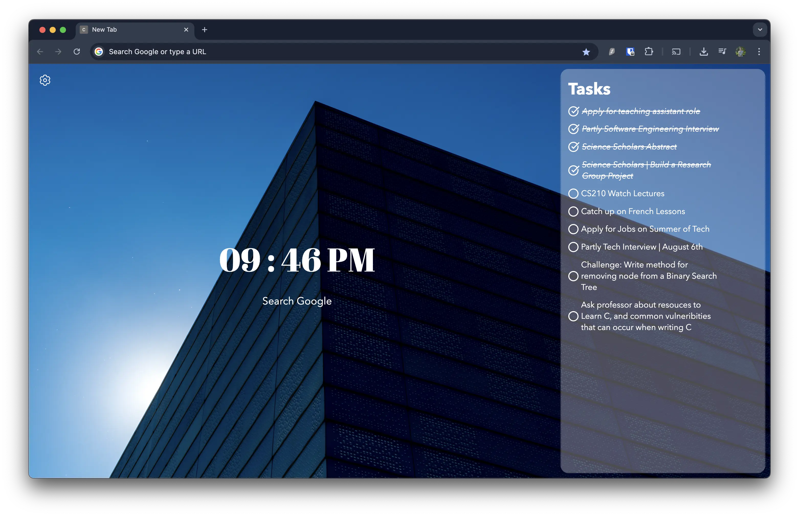

# Dash Page
Dash Page is a Chrome extension designed to transform your new tab page into a study hub! It is highly customizable, and it helps you stay focused and motivated by displaying essential study tools and a fun interactive pet feature.

This project is a work in progress. My aim for this is to gain more technical experience working with front-end technologies.



## Table of Contents
1. Key Features
2. Technologies Used
3. Installation
4. Project Structure
5. Licensing

## Key Features:
**Features I am working on** | [Todo List](./TODO.md)
- **To-Do List:** Keep track of your tasks and assignments
- **Exam Countdown Timer:** Stay aware of upcoming deadlines
- **Practice Exam Timer:** Practice an exam with time pressure
- **Pet Section:** A cute virtual pet that gets animated as you complete your tasks, providing positive reinforcement
- **Customization:** Customize the look and feel of your page, by changing the background, fonts, clock, and widget settings
- **Notifications:** Receive reminders for important events, like due tasks

## Technologies Used
- ReactJS + Redux
- HTML, CSS, JS
- Browser APIS (Chrome Extension APIs, Notifications API, localStorage, indexedDB)
- Figma (for Design)
- Github (for version control)

## Installation
Node.js and npm are required. If you don't have them installed, you can download them from [nodejs.org](https://nodejs.org/en/download)

1) Clone the repo:
   ```bash
   git clone https://github.com/WilliamM163/chrome_homescreen
   ```
2) Install Dependencies
    ```bash
    cd chrome_homescreen
    npm install
    ```
3) Run Dev Mode
    ```bash
    npm run dev
    ```
4) Install as a chrome extension
   1) Compile React App
        ```bash
        npm run build
        ```
    2) Open Chrome and navigate to `chrome://extensions/`
    3) Enable "Developer mode" in the top right corner
    4) Click "Load unpacked" and select the `dist` folder in your project directory
    5) The Chrome Extension should now be installed

## Project Structure
```
├── node_modules/
├── public/                
├── src/                        # Contains the main source code for the application
│   ├── app/                    # Core application logic
│   │   ├── features/           # Contains modular features of the application
│   │   │   └── background/     # Example feature: Background functionality
│   │   │       └── background.jsx
│   │   │       │   # React component for the background feature
│   │   │       └── backgroundSlice.js
│   │   │           # Redux slice for managing background state
│   │   ├── clock/
│   │   ├── search/
│   │   ├── App.jsx             # React component where other components are rendered
│   │   └── store.js            # Redux store configuration and root reducer
│   ├── assets/                 
│   └── main.jsx                # The entry point of the React application
├── index.css                   # Global styles for the application
├── index.html                  # The main HTML file that loads the React application
├── .gitignore       
├── package.json                # Contains project metadata, scripts, and npm dependencies
├── README.md                   # Project documentation (this file)
├── TODO.md                     # List of tasks or things to do
└── vite.config.js
```

## Licensing
This project is licensed under the terms of the GNU General Public License version 3.0
