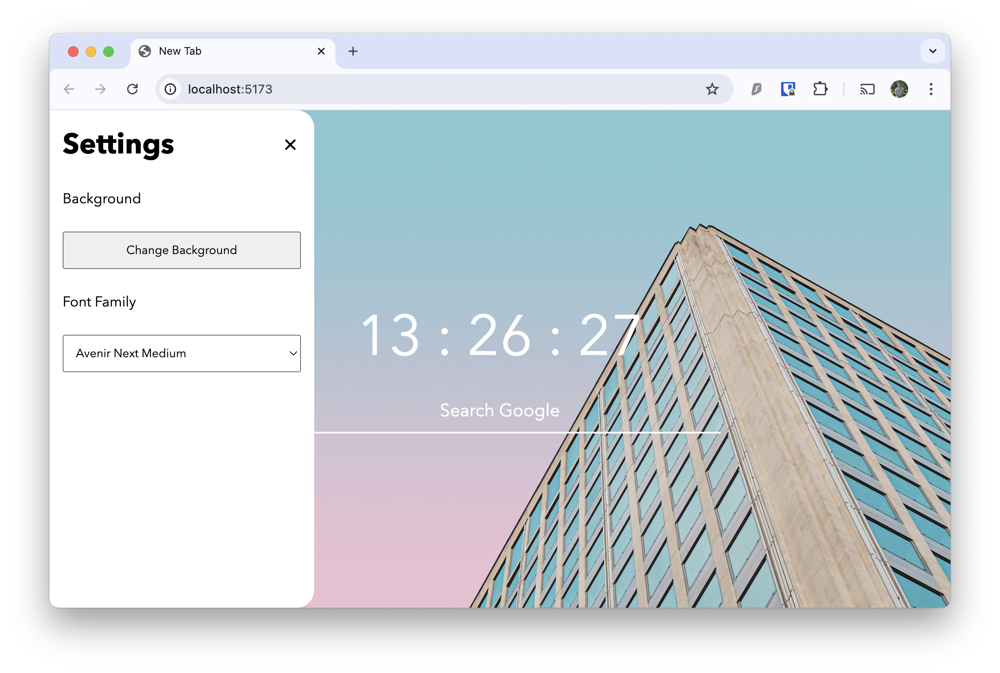

# Current Status

# Tasks
## App
**Top Priority**
- [x] Background
- [x] Clock and Search Widget

**Medium Priority**
- [ ] Settings Panel
  - [ ] Make components for common button styles
  - [x] Add Redux for State Management
  - [ ] Have state changes sync across tabs
    - https://daverivera90.medium.com/sharing-state-between-browser-tabs-with-redux-68899eb88fb7
    - Exploring using JS Storage Listener to update state
    - Maybe use redux-pouchdb middleware
    - Maybe use redux-state-sync middleware
  - [ ] Add Settings For Clock
  - [ ] Add Settings for changing background
    - [ ] Have a selection of default backgrounds
    - [ ] Selection of default colors
    - [ ] Have users *upload* their own background
  - [ ] Add Settings for changing default font

**Low Priority**
- [ ] Side Panel
  - [x] Tasks
  - [ ] Exam Countdown
  - [ ] Practice exam timer
  - [ ] Your pet section

## Generic
- [ ] Reference GPL License Properly
